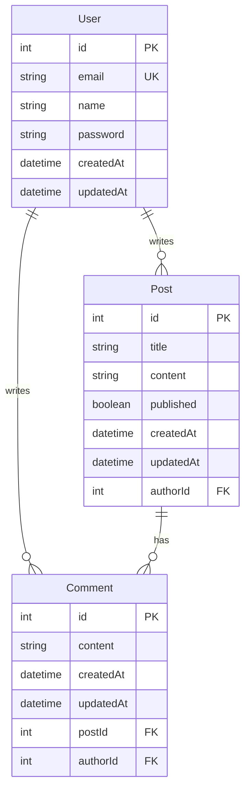

# Database Schema Diagram

## Entity Relationship Diagram

## Tables Overview

| Table    | Description                                      |
|----------|--------------------------------------------------|
| **User** | Registered accounts (email, name, hashed password) |
| **Post** | Blog articles written by users                   |
| **Comment** | User comments on posts                        |

## Relationships

- One **User** can have many **Posts** (1:N)
- One **User** can have many **Comments** (1:N)
- One **Post** can have many **Comments** (1:N)
- Deleting a user cascades to their posts and comments
- Deleting a post cascades to its comments

## API Endpoints Summary

### Authentication (Week 3)
| Method | Endpoint           | Description        |
|--------|--------------------|--------------------|
| POST   | `/api/auth/signup` | Register new user  |
| POST   | `/api/auth/login`  | Login, get JWT     |
| GET    | `/api/auth/me`     | Get current user   |

### Posts (Week 4)
| Method | Endpoint        | Auth     | Description      |
|--------|-----------------|----------|------------------|
| GET    | `/api/posts`    | No       | List all posts   |
| GET    | `/api/posts/:id`| No       | Get single post  |
| POST   | `/api/posts`    | Required | Create post      |
| PUT    | `/api/posts/:id`| Required | Update own post  |
| DELETE | `/api/posts/:id`| Required | Delete own post  |

### Comments (Week 4)
| Method | Endpoint                              | Auth     | Description        |
|--------|---------------------------------------|----------|--------------------|
| POST   | `/api/comments/posts/:postId/comments`| Required | Add comment        |
| DELETE | `/api/comments/:id`                   | Required | Delete own comment |
